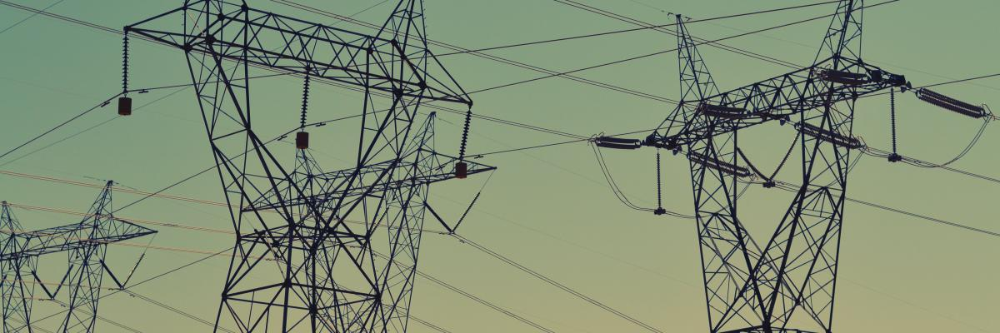

# Electricity Demand Forecasting using Time Series Analysis

Today, electricity consumption has become a primary concern for countries that have adopted it as a primary source of energy. Electricity demand forecasting is an analytical technique used to predict future levels of electricity usage. It helps utilities and other businesses understand where and when peak demand will occur. 
As the world continues to move towards digitalization, the demand for electricity increases constantly. This makes it essential for companies that operate in this space to be able to analyze their own electricity usage and forecast its demand accordingly, for risk managing purposes.

**Time series analysis** can be used to better understand characteristics of electricity demand and forecast usage patterns. In this project, time series analysis is used to uncover hidden relationships in electricity production data, predict future demand, and identify trends. Pandas and machine learning in Python have been used to perform the time series analysis.

Time series analysis performed on electricity consumption data to predict consumption for the next year.
