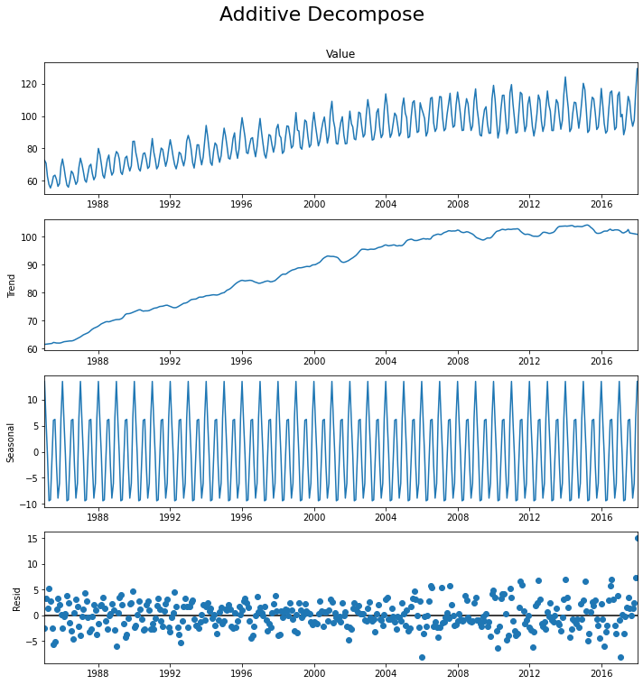

# Electricity Demand Forecasting using Time Series Analysis

## Introduction

Today, electricity consumption has become a primary concern for countries that have adopted it as a primary source of energy. Electricity demand forecasting is an analytical technique used to predict future levels of electricity usage. It helps utilities and other businesses understand where and when peak demand will occur. 
As the world continues to move towards digitalization, the demand for electricity increases constantly. This makes it essential for companies that operate in this space to be able to analyze their own electricity usage and forecast its demand accordingly, for risk managing purposes.

**Time series analysis** can be used to better understand characteristics of electricity demand and forecast usage patterns. In this project, time series analysis is used to uncover hidden relationships in electricity production data, predict future demand, and identify trends. Pandas and SARIMAX machine learning in Python have been used to perform the time series analysis and predicting the future.

## Solution

- Programming language: Python
- Tools: Jupyter Notebook
- Libraries: 
  - Pandas
  - Matplotlib
  - Statsmodels.Seasonal Decompose
  - Statsmodels.SARIMAX

## Exploratory Data Analysis

The raw data for this project contains a time series data of a single variable, the electricity amount. The data is aggregated on a monthly basis from January 1st, 1985 to January 1st 2018.

A quick visualization by Matplotlib for the electricity generation throughout the years looks like below:

A periodicity can be observed from the data.

Luckily the data is clean so not much data cleaning was carried out. 

## Time Series Analysis

Multiple approaches have been taken to perform the time series analysis:
- Seasonal Decompose (by Statsmodel)
  - Additive decompose
  - Multiplicative decompose
- SARIMAX

### Seasonal Decompose
Any time series may be split into the following components: Base Level + Trend + Seasonality + Error

Additive time series:
Value = Base Level + Trend + Seasonality + Error

Multiplicative Time Series:
Value = Base Level x Trend x Seasonality x Error

### SARIMAX

SARIMAX(Seasonal Auto-Regressive Integrated Moving Average with eXogenous factors) is an updated version of the ARIMA model. ARIMA includes an autoregressive integrated moving average, while SARIMAX includes seasonal effects and eXogenous factors with the autoregressive and moving average component in the model. Therefore, we can say SARIMAX is a seasonal equivalent model like SARIMA and Auto ARIMA.

## Conclusions

We can see that the model has predicted the values without compromising with the seasonality effects and exogenous factors. And the trend line is almost going as usual as it was going in past years.

## Future Work

This work provides an initial exploration to the time series data for electricity productinon. More work can be conducted more in-depth to draw more insights into the data, as well as improving the prediction accuracy.

A few items that can be added to the projects are:
- Perform regression on the trend for additive decomposition/multiplicative decompositioin to predict the future
- Perform prediction using additive decomposition/multiplicative decompositioin
- Get more insights into the seasonalithy. For example, find the frequency of seasonality by calculating the time between two identical points in the seasonality results.
- Hyperparameter tuning for the SARIMAX model for the maximum accuracy. 

## References

1. Data Source file: Time series analysis - predicting the consumption of electricity in the coming future ([click here for link](https://www.kaggle.com/datasets/kandij/electric-production))
2. Time Series Analysis in Python ([click here for link](https://www.machinelearningplus.com/time-series/time-series-analysis-python/))

